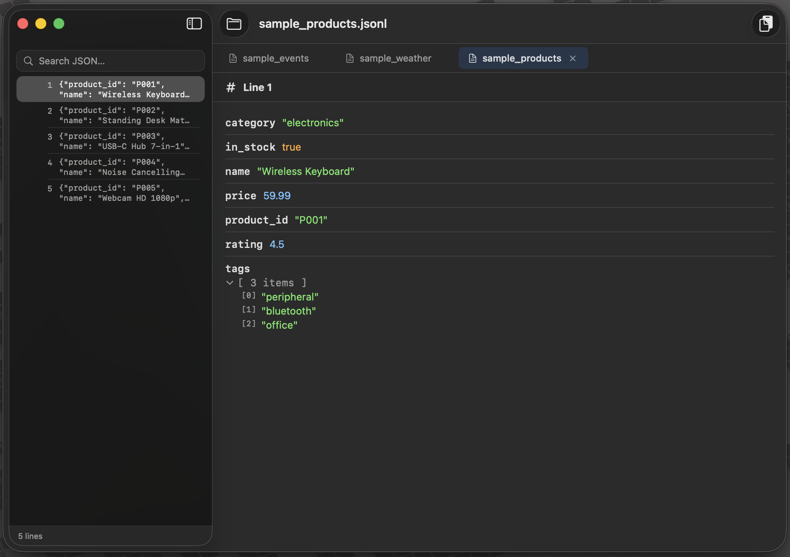

# Parsely

A macOS app for viewing and exploring JSONL (JSON Lines) and Markdown files. Built because I couldn't find one that didn't make me want to punch my monitor.

## Why This Exists

I've been teaching myself to fine-tune models, and with the release of Gemma 4, I wanted to train on my own datasets: lectures, writings, LinkedIn posts. That means working with a lot of JSONL files.

Preparing training data by hand wasn't feasible, so I built prompts in Claude Code to analyze and clean my datasets. Claude is a great model, but I still needed to check its work. No code review tool or security analyzer can tell me whether my data was properly parsed. That's on me to verify.

The problem was actually looking at the files. TextMate, VS Code, TextEdit: each one hit me with a massive wall of single-line JSON stretching infinitely to the right. Completely unusable. I searched for a decent native Mac viewer, tried a few, and nothing fit what I needed: a simple app that parses each line, gives me a collapsible JSON tree, and lets me search across lines.

Then I kept using it for Markdown files too — READMEs, design docs, code review reports. MacDown didn't render lists well, and raw Markdown in a text editor isn't much better than raw JSONL. So I added a Markdown viewer with rendered output, a heading tree sidebar, and scroll-aware navigation.

Now, is it possible that a perfect JSONL/Markdown viewer for Mac exists, or a plugin for an app I already have, and I simply failed at searching the internet? Absolutely. If you find one, please don't tell me. I've already built this and I'm emotionally invested.

## What It Does

### JSONL Viewer

- **Line-by-line JSONL parsing** with error handling for malformed lines
- **Collapsible JSON trees** with syntax highlighting (strings, numbers, booleans, null)
- **Real-time search** across all lines in a file
- **Jump to line** (Cmd+G)
- **Pretty-print export** — copy any line as formatted JSON to clipboard (Cmd+Shift+C)

### Markdown Viewer

- **Rendered markdown** — headings, lists, code blocks, tables, blockquotes, bold/italic/links
- **Heading navigation** — sidebar shows a searchable heading tree; click to jump to any section
- **Scroll-aware sidebar** — sidebar highlights the heading you're currently reading as you scroll
- **Anchor links** — in-document links (like a Table of Contents) scroll to the target heading
- **Resizable tables** — drag the right edge of any table to adjust its width

### Shared

- **Multi-file tabs** — open JSONL and Markdown files side by side
- **Drag and drop** — drop files directly into the app
- **Open with Parsely** — double-click files in Finder or use "Open With"; the file opens as a new tab in the Parsely window on your current macOS Space, or creates a new window on that Space if none exists yet
- **Per-Space windows** — on multi-desktop setups, each Space keeps its own Parsely window with its own tab set, so Desktop 1 and Desktop 2 don't mix
- **Zoom** — scale the detail pane from 50% to 200% (persists across sessions)
- **Dark mode** — adaptive colors that follow your system appearance
- **Native macOS** — SwiftUI, no Electron, no web views

## Install

Download the latest DMG from [Releases](../../releases), open it, and drag Parsely to your Applications folder.

> **Note:** This app is not notarized with Apple. On first launch, macOS will warn you that it "can't be opened because Apple cannot check it for malicious software." Right-click the app, then click Open, then click Open again to bypass this. You only need to do this once.

## Supported File Types

| Extension | Type |
|-----------|------|
| `.jsonl` | JSON Lines |
| `.ndjson` | JSON Lines |
| `.md` | Markdown |
| `.markdown` | Markdown |
| `.mdown` | Markdown |
| `.mkd` | Markdown |

## Keyboard Shortcuts

| Shortcut | Action |
|----------|--------|
| Cmd+O | Open file |
| Cmd+G | Jump to line |
| Cmd+Shift+C | Copy line as pretty JSON |
| Cmd+W | Close tab |
| Cmd+[ | Previous tab |
| Cmd+] | Next tab |
| Cmd+= | Zoom in |
| Cmd+- | Zoom out |
| Cmd+0 | Actual size |
| Option+Up | Previous line |
| Option+Down | Next line |
| Arrow keys | Navigate lines (when sidebar is focused) |

## Sample Files

The `sample-files/` directory includes files you can use to test the app:

**JSONL** (`sample-files/jsonl/`)
- `sample_products.jsonl` — Product catalog with nested arrays
- `sample_events.jsonl` — Analytics events with nested objects
- `sample_weather.jsonl` — Weather data with flat records
- `sample_malformed.jsonl` — Mix of valid and broken lines to demonstrate error handling
- `sample_completely_broken.jsonl` — Every line fails to parse

**Markdown** (`sample-files/markdown/`)
- `sample_stack_recommendation.md` — Technical recommendation with tables, code blocks, lists, and anchor-linked TOC
- `sample_code_review.md` — Code review report with findings, diff blocks, and severity tables

## How It Was Built

The initial release was built entirely with [Claude Code](https://claude.ai/claude-code) in a single session. The speed was possible because of a reusable `.claude/` directory I maintain for building native macOS and iOS apps. It contains specialized agents — a macOS developer, a designer, a QA engineer — along with skills that stay current on modern Swift patterns, SwiftUI best practices, and Human Interface Guidelines. Point it at a new Xcode project and it already knows how to write, review, and test native Mac apps. This `.claude/` dir is added to this repo.

**Tech stack:** Swift, SwiftUI, @Observable, async/await, macOS 14.0+

## Requirements

- macOS 14.0 (Sonoma) or later

## License

MIT
